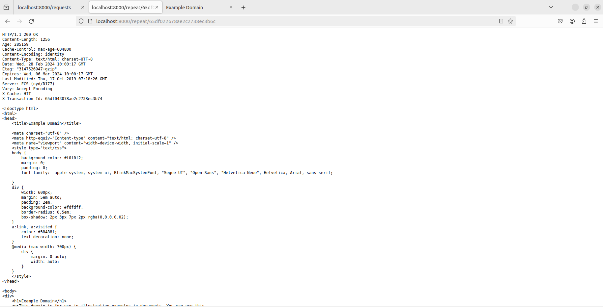

# InformationSecurity_Homework_1

### 1. Запуск прокси-сервера с https в Docker с хранением запросов в MongoDB

- Запустить `sudo docker-compose up`
- Собрать бинарный файл Go `sh build.sh`
- Запустить `./build/proxy/out`
- Скопировать сертификаты `sudo cp ~/.mitm/ca-cert.pem /usr/local/share/ca-certificates/ca-cert.crt`
- Обновить сертификаты `sudo update-ca-certificates`

### 2. Тестовые запросы

- `curl -x http://127.0.0.1:8080 https://example.org` (для простоты нахождения запроса в БД, т.к. сложные сервисы вроде mail.ru делают множество запросов на сторонние ресурсы)

### 3. Запуск сервера для работы с БД

- Запустить `./build/webApi/out`
- "Ручки" для работы с БД:
  1. `/requests` для отображения распаршенного списка всех запросов
  2. `/requests/{id}` для отображения распаршенного запроса по его id
  3. `/repeat/{id}` для отображения ответа сервера

### 4. Настройка прокси браузера (на примере Firefox)

1. В настройках браузера необходимо зайти в настройки прокси (их можно найти через поиск)

   

2. Настраиваем прокси

   

3. В настройках браузера устанавливаем сгенерированные сертификаты

   

4. Устанавливаем сертификаты `ca-cert.pem` из папки `~/.mitm/`

   
   

5. Очищаем историю браузера (лишь в этом случае не возвращается 304, хотя заголовки в middleware удаляются)
   
   

6. Заходим на сервер с БД `http://localhost:8000/requests`
7. Т.к. в примере указан сайт `http://example.org`, то ищем его через поиск (можно написать дополнительную middleware, чтобы отображаемые результаты были в формате json, но тогда для более масштабных сайтов сложнее искать нужную страницу, т.к. они совершают много запросов, а в этом случае можно быстро через поиск это сделать)
   
   

8. Копируем `id` запроса и переходим по ссылке `http://localhost/repeat/{id}`, на которой выводится ответ сервера

    
